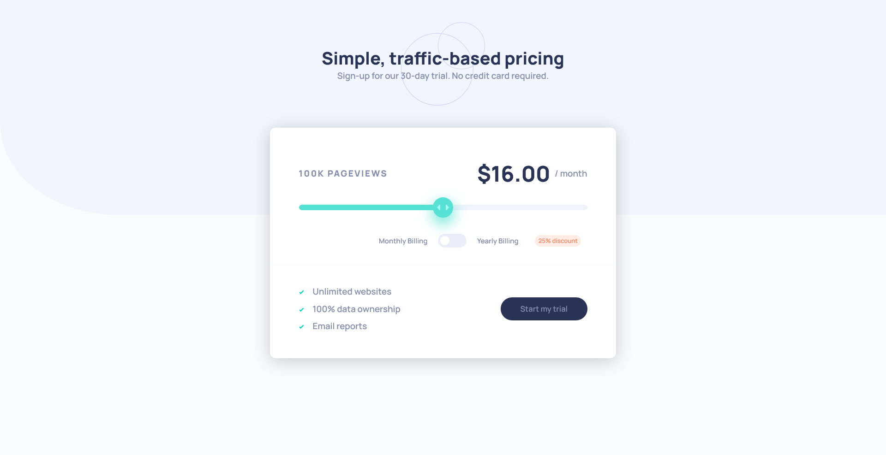

# Frontend Mentor - Interactive pricing component solution

This is a solution to the [Interactive pricing component challenge on Frontend Mentor](https://www.frontendmentor.io/challenges/interactive-pricing-component-t0m8PIyY8). Frontend Mentor challenges help you improve your coding skills by building realistic projects. 

## Table of contents

- [Overview](#overview)
  - [The challenge](#the-challenge)
  - [Screenshot](#screenshot)
  - [Links](#links)
- [My process](#my-process)
  - [Built with](#built-with)
  - [What I learned](#what-i-learned)
  - [Continued development](#continued-development)
  - [Useful resources](#useful-resources)

## Overview

### The challenge

Users should be able to:

- View the optimal layout for the app depending on their device's screen size
- See hover states for all interactive elements on the page
- Use the slider and toggle to see prices for different page view numbers

### Screenshot

### Links

- Live Site URL: [Github pages](https://thomas-auffroy.github.io/Interactive-pricing-component/)

## My process

### Built with

- CSS custom properties
- Flexbox
- CSS Grid

### What I learned

With this projet, I learned to build a slider in HTML/CSS. AddEventListener faut parler de ça. 

### Continued development

Image background qui s'attache bien au body mais pas au container. Contiuer à bien struturer l'HTML pour que l'adaptabilité soit plus facile. Continue à apprendre le js pour avoir une bonne strcuture de code. Regarder si querryselector est une bonne méthode.

### Useful resources

- [Mozilla](https://developer.mozilla.org/en-US/docs/Web/CSS) - The main site I use to look for informations.